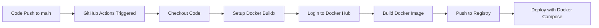

# Task-1 CI/CD GitOps Pipeline

A Next.js web application with automated CI/CD pipeline using GitHub Actions and Docker containerization.

## 🏗️ Architecture Overview

This project implements a modern CI/CD pipeline with the following components:

- **Application**: Next.js 15 web application (Morphic AI search interface)
- **Containerization**: Multi-stage Docker build
- **CI/CD**: GitHub Actions workflow
- **Registry**: Docker Hub for image storage
- **Deployment**: Docker Compose orchestration

## 📋 CI/CD Pipeline Details

### Pipeline Trigger
- **Event**: Push to `main` branch
- **Workflow File**: `.github/workflows/cicd.yaml`

### Pipeline Stages

#### 1. **Code Checkout**
```yaml
- name: Checkout code
  uses: actions/checkout@v3
```
- Retrieves the latest source code from the repository

#### 2. **Docker Environment Setup**
```yaml
- name: Set up Docker Buildx
  uses: docker/setup-buildx-action@v3
```
- Configures Docker Buildx for advanced build features
- Enables multi-platform builds and caching

#### 3. **Registry Authentication**
```yaml
- name: Login to DockerHub
  uses: docker/login-action@v3
  with:
    username: ${{ secrets.DOCKERHUB_USERNAME }}
    password: ${{ secrets.DOCKERHUB_TOKEN }}
```
- Authenticates with Docker Hub using stored secrets
- Required secrets:
  - `DOCKERHUB_USERNAME`: Docker Hub username
  - `DOCKERHUB_TOKEN`: Docker Hub access token

#### 4. **Build & Push**
```yaml
- name: Build and Push Docker Image
  uses: docker/build-push-action@v5
  with:
    context: .
    push: true
    tags: hatakekakashihk/webapp:latest
```
- Builds Docker image using multi-stage Dockerfile
- Pushes image to Docker Hub registry
- Tags image as `latest`

## 🐳 Docker Configuration

### Multi-Stage Dockerfile

#### Build Stage
```dockerfile
FROM node:slim AS build
RUN apt-get update && apt-get install -y git
WORKDIR /usr/src/app
RUN git clone https://github.com/Elevate-labs-intership/Task-1-CI-CD-GITOPS.git
WORKDIR /usr/src/app/Task-1-CI-CD-GITOPS
RUN npm install && npm run build
```

#### Runtime Stage
```dockerfile
FROM node:slim
WORKDIR /usr/src/app/
COPY --from=build /usr/src/app/Task-1-CI-CD-GITOPS ./
CMD ["npm", "run", "start"]
```

### Benefits of Multi-Stage Build
- **Reduced Image Size**: Excludes build dependencies from final image
- **Security**: Minimizes attack surface
- **Performance**: Faster deployment and startup times

## 🚀 Deployment Options

### Option 1: Simple Deployment
```bash
docker run -p 3000:3000 hatakekakashihk/webapp:latest
```

### Option 2: Docker Compose (Recommended)
```yaml
services:
  Web:
    image: hatakekakashihk/webapp:latest
    container_name: Website
    ports:
      - "3000:3000"
```


## ⚙️ Setup Instructions

### Prerequisites
- Docker and Docker Compose installed
- GitHub repository with Actions enabled
- Docker Hub account

### Repository Secrets Configuration
Add the following secrets to your GitHub repository:

1. Go to **Settings** → **Secrets and variables** → **Actions**
2. Add repository secrets:
   - `DOCKERHUB_USERNAME`: Your Docker Hub username
   - `DOCKERHUB_TOKEN`: Docker Hub access token

### Local Development
```bash
# Clone repository
git clone https://github.com/Elevate-labs-intership/Task-1-CI-CD-GITOPS.git
cd Task-1-CI-CD-GITOPS

# Install dependencies
npm install

# Run development server
npm run dev

# Build for production
npm run build

# Start production server
npm start
```

## 🔄 Pipeline Workflow



## 📊 Pipeline Status

- **Build Time**: ~3-5 minutes
- **Image Size**: Optimized with multi-stage build
- **Deployment**: Automated on successful build
- **Registry**: Docker Hub public repository

## 🛠️ Technology Stack

- **Frontend**: Next.js 15, React 19, TypeScript
- **Styling**: Tailwind CSS
- **Authentication**: Supabase Auth
- **Search**: Multiple AI providers (OpenAI, Anthropic, Google, etc.)
- **Database**: Redis for caching
- **Search Engine**: SearXNG
- **Containerization**: Docker
- **CI/CD**: GitHub Actions
- **Registry**: Docker Hub

## 🔧 Troubleshooting

### Common Issues

1. **Build Failures**
   - Check Docker Hub credentials in repository secrets
   - Verify Dockerfile syntax and dependencies

2. **Deployment Issues**
   - Ensure port 3000 is available
   - Check container logs: `docker logs Website`

3. **Environment Variables**
   - Create `.env.local` file for local development
   - Configure environment variables in deployment environment

### Monitoring
```bash
# Check container status
docker ps

# View container logs
docker logs Website

# Monitor resource usage
docker stats Website
```

## 📈 Future Enhancements

- [ ] Add automated testing stage
- [ ] Implement staging environment
- [ ] Add security scanning
- [ ] Configure monitoring and alerting
- [ ] Implement blue-green deployment
- [ ] Add Kubernetes deployment manifests

## 🤝 Contributing

1. Fork the repository
2. Create a feature branch
3. Make your changes
4. Test locally
5. Submit a pull request

The CI/CD pipeline will automatically build and deploy your changes when merged to the main branch.